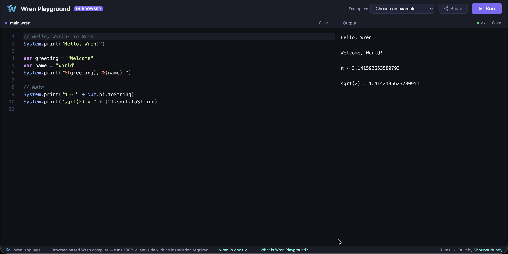
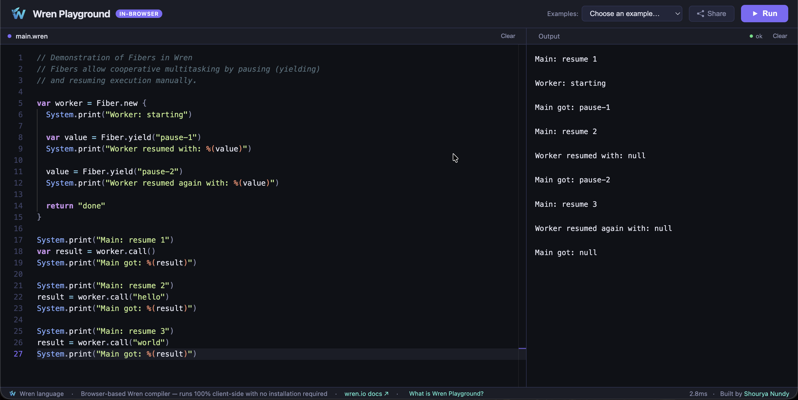
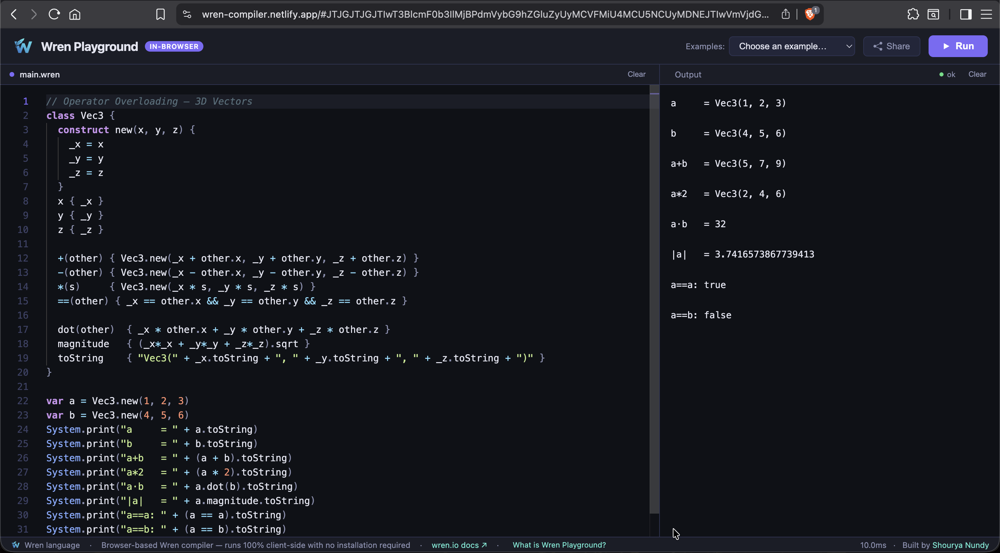

# Wren Playground — Browser-Based Wren Execution Environment

> **Run Wren code instantly in your browser. No installation, no server, no runtime dependencies.**

[](https://wren-compiler.netlify.app/)
[](https://wren.io)
[](LICENSE)

---

## What Is This?

**Wren Playground** is a fully client-side execution environment for the [Wren programming language](https://wren.io) — a small, fast, class-based scripting language designed for embedding in game engines and applications (most notably used in the [DOME engine](https://domeengine.com)).

Unlike server-rendered REPLs or containerised sandbox runners, Wren Playground executes code **entirely inside the browser**. There is no backend, no code transmission, and no network latency between writing and running. The full execution pipeline runs in a single browser tab.

---

## Why Does This Exist?

Wren is a well-designed language with a clean syntax, first-class closures, single-inheritance classes, and an elegant fiber-based concurrency model. Despite this, the developer tooling ecosystem is sparse:

- There is **no official online playground**
- The only way to try Wren today is to build the C VM from source or use a language binding
- This creates a significant friction barrier for developers evaluating the language or writing quick demos

Wren Playground eliminates that friction entirely. **Write → Run → Share** in seconds, with no setup.

---

## Why This Project Matters

For developers, a browser-based language environment often determines whether they engage with a language at all. Languages like Go, Rust, Python, and TypeScript all have polished online runners that make first-contact frictionless.

Wren has none of that. This project directly improves the Wren ecosystem by:

- Making Wren accessible to developers who encounter it through game dev, scripting, or language research
- Providing a shareable link format so Wren code snippets can be referenced in documentation, tutorials, and StackOverflow answers
- Serving as a test environment for developers embedding Wren in their own applications

---

## Features

| Feature | Details |
|---|---|
| **Full language support** | Variables, closures, classes, inheritance, operator overloading, fibers, string interpolation, ranges |
| **Monaco Editor** | VS Code's editor engine — syntax highlighting, keyboard shortcuts, Wren-specific token colours |
| **Instant execution** | No compile step, no network round-trip |
| **Shareable links** | Code is encoded in the URL hash — share a runnable snippet with a single link |
| **Example library** | 10 built-in examples covering major language features |
| **Zero dependencies** | No npm, no bundler, no server |
| **Privacy** | Your code never leaves your browser |

---

## Screenshots


*The Monaco-powered editor with Wren syntax highlighting*


*Running the built-in Fiber coroutine example*


*Generate a unique URL containing your current Wren script and share it instantly.
Opening the link restores the code inside the playground automatically*

---

## Architecture Overview

The project is a single self-contained HTML file. The architecture has three layers:

```
┌─────────────────────────────────────────────────────┐
│                   Browser (Client)                   │
│                                                      │
│  ┌──────────────┐     ┌───────────────────────────┐ │
│  │ Monaco Editor│────▶│   Wren Execution Engine   │ │
│  │  (VS Code)   │     │                           │ │
│  └──────────────┘     │  Lexer → Parser → Runtime │ │
│                       │                           │ │
│  ┌──────────────┐     │  Built-in classes:        │ │
│  │  Output      │◀────│  Num, String, List, Map,  │ │
│  │  Console     │     │  Range, Fn, Fiber, System │ │
│  └──────────────┘     └───────────────────────────┘ │
│                                                      │
│  ┌──────────────────────────────────────────────┐   │
│  │  URL Sharing (Base64-encoded code in hash)   │   │
│  └──────────────────────────────────────────────┘   │
└─────────────────────────────────────────────────────┘
```

**Key engineering decisions:**

- **No WebAssembly, no server** — the execution engine runs as pure JavaScript, making it trivially deployable to any static host with zero configuration
- **Single-file distribution** — the entire application including the runtime is a single `.html` file; it can be downloaded and run locally with no internet connection
- **Monaco editor integration** — provides a production-quality editing experience with custom Wren syntax grammar, matching the ergonomics of VS Code
- **URL-based persistence** — code state is encoded directly in the URL fragment using Base64, enabling sharing without a database or backend service
- **Fiber concurrency model** — Wren's coroutine system (`Fiber.yield`, `Fiber.call`) is supported via a buffered execution model that correctly sequences side effects across yield boundaries

---

## Supported Language Features

```wren
// Classes and inheritance
class Animal {
  construct new(name) { _name = name }
  name { _name }
}
class Dog is Animal {
  speak() { System.print(_name + ": Woof!") }
}

// Closures and higher-order functions
var evens = (1..20).toList.where { |n| n % 2 == 0 }
System.print(evens.reduce(0) { |a, b| a + b })  // 110

// Operator overloading
class Vec2 {
  construct new(x, y) { _x = x  _y = y }
  +(other) { Vec2.new(_x + other.x, _y + other.y) }
}

// Fibers (coroutines)
var counter = Fiber.new {
  var i = 0
  while (i < 5) { Fiber.yield(i)  i = i + 1 }
}
while (!counter.isDone) System.print(counter.call())
```

---

## Getting Started (Local)

No build step. No dependencies. Just open the file:

```bash
# Clone or download the project
open index.html   # macOS
start index.html  # Windows
xdg-open index.html  # Linux
```

Or visit the live version at [wren.tools](https://wren.tools).

---

## Deployment

The project is a single static HTML file. It deploys to any static host in under a minute:

```bash
# Netlify (drag and drop the HTML file, or connect via GitHub)
# Vercel, GitHub Pages, Cloudflare Pages — all work identically
```

---

## Technical Challenges Solved

Building a browser-based execution environment for a language with no existing JS runtime involves a range of non-trivial engineering problems:

**Parsing**
- Full Wren grammar implemented including Pratt-style precedence climbing for expressions, recursive descent for statements, and string interpolation handling
- Correct newline-as-statement-terminator semantics with multi-line continuation detection for chained method calls

**Runtime semantics**
- Iterator protocol (`iterate` / `iteratorValue`) enabling `for` loops over any custom class
- Implicit last-expression return in method and closure bodies
- `super` constructor delegation with correct field propagation
- Operator overloading dispatch with arity-based method resolution
- Dynamic field storage on instances (open-object model)

**Concurrency**
- Wren's fiber (coroutine) system implemented without JS generators by using an eager execution model with output buffering between yield points — preserving correct side-effect ordering without rewriting the interpreter

**Editor integration**
- Custom Wren syntax grammar for Monaco with contextual token types, matching VS Code's Wren extension behaviour

---

## Future Improvements

- [ ] **Persistent snippets** — saved snippets with short IDs (requires minimal backend or localStorage)
- [ ] **Module system** — multi-file support with `import` statement emulation
- [ ] **Runtime visualisation** — call stack, variable inspector, heap view
- [ ] **Embeddable widget** — `<iframe>`-ready mode for documentation sites
- [ ] **WASM backend** — optional Emscripten-compiled native Wren VM for performance-critical code
- [ ] **Test runner mode** — inline assertion syntax with pass/fail output
- [ ] **Diff / history** — snapshot history of past runs in a session

---

## Project Status

Active. The interpreter covers the full Wren language specification including classes, closures, fibers, operator overloading, string interpolation, and all core built-in classes.

---

## About Wren

Wren is a small, fast, class-based scripting language created by Bob Nystrom (author of *Crafting Interpreters*). It is designed to be embedded in applications — particularly games — and is the scripting language of the [DOME game engine](https://domeengine.com). Despite its elegance, it has minimal online tooling compared to other scripting languages.

Official docs: [wren.io](https://wren.io) · Source: [github.com/wren-lang/wren](https://github.com/wren-lang/wren)

---

## License

MIT © 2025 Shourya Nundy
